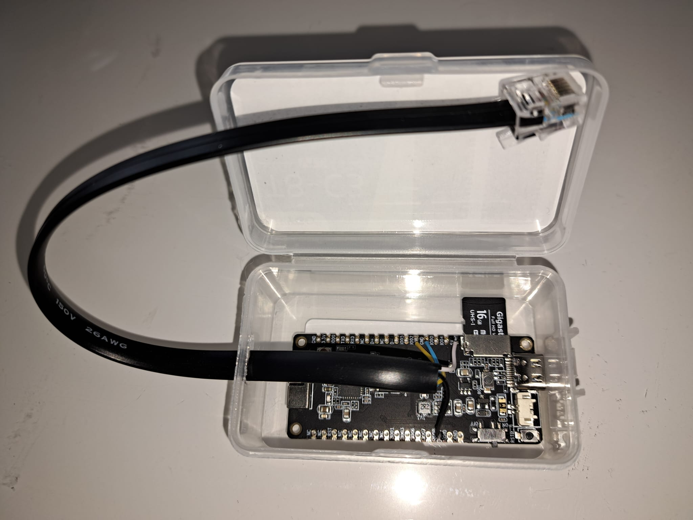

[](README.md)

# Digital power meter monitor
The digital power meter monitor is for power meters installed in Belgium. It can measure and show the current or past power measurements in real-time on your phone or PC/laptop.
Screenshots are in Dutch: 


The digital power meter has a "P1 port" through which the measurements can be received. 
> Using the "S1 port" will likely destroy the monitor. 


The P1 port is disabled by default and can be opened through an action on the website of your network operator (like Fluvius) typically. However, it can take days for it to get activated. 

The monitoring is done using an ESP32 board for which the software is here. 
In the board sections below the needed hardware connections to an RJ12 cable that one can plug into the power meter P1 port are described per supported ESP32 board. You need an RJ12 cable with 6 wires, called: 6P6C, not 6P4C

Detailed measurements per quarter are stored on a micro SD card in JSON format. Hence we focus on boards that have the SD card reader integrated, but leaving other options open. Use an 8GB micro SD card or up to 64GB (only tested up to 16GB). It is best to reformat the SD card first and choose a small cluster size because the stored files are all small. 

The board is connected to Wifi and exposes a web interface, meant for in-home access only (HTTP), on which one can see the current measurements almost in real-time (updated every 5 seconds by default) or navigate to historical measurements.

The measurements are shown per fixed quarter in the hour because the average watt consumption per quarter can be penalized by higher electricity costs when they exceed 2500 Watts. One incurs an additional cost of approximately 4 euros (as of the 2023 reference) for each additional 1000 Watts on the highest quarter-average consumption per month. This pertains to the capacity tariff, known as 'capaciteits tarief' in Dutch."

One can easily jump back to the details of the quarter causing the month peak by pressing the "month peak" button if the monitor measured that quarter. 


The source code can deal with multiple boards in theory. In practice, the LilyGo TTGO T8 ESP32-C3 board is mostly used and thus certainly working. It is also the most power-efficient.


# Using the source code
Make sure you have Visual Studio Code with "Platform IO" installed as an ESP coding environment. 
Platform IO has an alien-like icon on the left side of Visual Studio Code to activate it. 
Clicking on it, you should be able to see the "PIO Home" tab. 

Clicking on the project should show a tab per target hardware device. 

For example: "TTGO_T8_ESP32_C3"  

See specific board sections below for their hardware-specific setup.

To get a working board, you need to build and upload the filesystem image and the C/C++ code. (Do this with Platform IO Project Tasks). There might be board-specific actions needed to get it in a state where the items can be uploaded over the USB cable. 

Make sure there is a micro SD card plugged into the board. 


# Using the board with the installed code
## First startup or startup with Wifi connection problems
Upon first startup, the board will try to locate Wifi connection parameters from the config.json file on the micro SD card. 
If this file doesn't exist or the board cannot connect to the Wifi network, it will start in configuration mode and act as an access point for a Wifi network "DigitaleMeterMonitor". This uses an IP Subnet 192.168.4.0/24 on which the board has the IP 192.168.4.1.
As such one can connect to that Wifi network and browse to http://192.168.4.1 to configure the Wifi settings.
Sometimes it is difficult to stay on the board's network since it has no path to the internet. In the configuration, the board will require a :
- Wifi network / SSID to connect to
- Wifi network password
- IPAddress: The board needs a fixed IPAddress for in-home use (No DHCP). Choose a free address in your home network, typically ending in a high value. Our default is 192.168.0.250. If you have Telenet as an ISP Provided you can have a look at the currently used IP addresses in your home on their website ("Mijn Telenet"). Typically addresses from .0 up to .249 are handed out by DHCP, which is why our default is 250.  
- Subnet: This is typically 192.168.0.0/24. This depends on your in-house setup / Telecom provider
- Gateway IP: This is typically 192.168.0.1 or the .1 address in another chosen subnet. 


Once this config is submitted it will be saved to the SD card in the config.json file. 

The board will then reset and attempt to connect to the Wifi. 

Upon startup, the onboard LED will light up bright in several sequences. 
Eventually, the onboard LED should dim. This means it started up ok and is awaiting data from the digital power meter. 
If the board is connected to the digital power meter using the RJ12 cable (see pinout and connection schemas for each board in sections below), the dimmed LED should even pulsate a couple of times per second. This indicates the measurements are coming in. 

## Viewing the measurements
If the board is running you should be able to contact it on its IP address over HTTP. By default browse to http://192.168.0.250. You should then see the measurements. 

## Alternative Wifi config
An alternative way to configure the board to proper Wifi is to power it off, unmount the SD card from it and put it in a laptop/PC from where you can edit the config.json. 

The config.json looks like:
````
{
  "wifi": {
    "ssid": "yourSSID",
    "password": "yourPassword"
  },
  "network": {
    "ip" : "192.168.0.250",
    "gateway": "192.168.0.1",
    "subnet": "255.255.255.0"
  }
}
````

Change what you want, save, properly unmount the card from the laptop/PC and remount it on the board. 
Connect the board. 

## Debug the startup with the serial monitor
Upon trouble with startup, one can also use the Platform IO serial monitor to see what the board is doing upon startup. 
If monitored serially it emits messages like:

  ````
  Digital meter monitor using board: LilyGo TTGO T8 ESP32 C3 V1.1
  LED pin: 3
  Ports used for SD Card communication:
  MOSI: 7
  MISO: 5
  SCK: 4
  SS: 6
  SD Card sectorsPerCluster  64      
  SD Card OK
  Creating test dir /meter/2022/01/01
  Creating test file /meter/2022/01/01/hello.txt
  Serial pins used for communication to digital meter:
  RX1: 2, TX1: 0, RTS 8
  LittleFS Init OK
  No prior WIFI config
      Setup Mode
  --------------------------------
  SSID:
  DigitaleMeterMonitor
  Connect IP:
  192.168.4.1
  ````

The pin values will vary per board type. 

In this example, the device starts up as an access point with an SSID "DigitaleMeterMonitor". 

When the Wifi is connecting fine you will see on the debug terminal:
  ````
  Digital meter monitor using board: LilyGo TTGO T8 ESP32 C3 V1.1
  LED pin: 3
  Ports used for SD Card communication:
  MOSI: 7
  MISO: 5
  SCK: 4
  SS: 6
  Init SD SLOT SPI...
  SD SLOT SPI Pins set
  SD Card sectorsPerCluster  64      
  SD Card OK
  Creating test dir /meter/2022/01/01
  Creating test file /meter/2022/01/01/hello.txt
  Serial pins used for communication to digital meter:
  RX1: 2, TX1: 0, RTS 8
  LittleFS Init OK
  Opened /config.json file, size 138
  Previous SSID:
  ghost

  Connecting ...
  WL_CONNECTED
  Connected !
  192.168.0.248
  Syncronizeer Tijd
  --------------------------------
  ..............................Synced in 3000 ms.
  2023-12-02 13:37:27
  Verbruiksmonitor
  --------------------------------
````

After the board has software and can connect to Wifi, it can be upgraded by browsing to:
````
http://<ipaddress>/update
````

This gives you a user interface where build output files can be uploaded for code or data(file system), as needed. 

# Web application development
The data folder contains the files for the web application. 
These files are put in the flash filesystem on the ESP board. This file system is also known as little FS. 
Your main interest will be the index.html file. 
This gets current and historic data using HTTP GET calls like: 
- GET http://&lt;ip&gt;/current/quarter 
- GET http://&lt;ip&gt;>/meter/2023/12/01/1615W.json
- GET http://&lt;ip&gt;>/current/month/peak

The index.html page detects when it is served from localhost. In this case, it does the above GET calls to 192.168.0.250 so a functioning board plugged in your home digital power meter can serve the requests. This facilitates debugging because you can change the index.html file faster on the laptop/PC, save it and reload it in your browser to see the change effect. 
It does mean that the index.html file needs to be served from the laptop/PC. 
To do this, there is a python httpserver.py file in the data folder which can be run. 
To start service index.html on the local port 8000:
````
  cd data
  python httpserver.py
````
You need a version of Python installed. Tested with Python 3.11.1 on a Windows PC. 

After this you can browse to: 
http://localhost:8000
and you can start debugging/changing the html and javascript code as you wish. 

# Board specifics
## TTGO T8 ESP32-C3
See: [LilyGo ESP32-C3 board with SD card interface](https://www.lilygo.cc/products/t8-c3)   
See: [NL Supplier link](https://www.tinytronics.nl/shop/en/development-boards/microcontroller-boards/with-wi-fi/lilygo-ttgo-t8-c3-esp32-c3-4mb-flash)

This is a LilyGO TTGO T8 ESP32-C3 module, which has an integrated SD card interface. 

- One needed to install special Serial USB drivers and reboot the PC or laptop first before the connection was even recognized as a serial port...
  See: [Espressif page](https://docs.espressif.com/projects/esp-idf/en/v5.0.2/esp32c3/get-started/establish-serial-connection.html)
  Sometimes the serial port only comes up after using some other board or USB device as well ...
- To get the first Serial to work for debugging, we needed to set additional build flags so the first hardware serial goes out to the USB connector.
  ```` 
  build_flags = 
    -D TTGO_T8_ESP32_C3
    -DARDUINO_USB_MODE=1
    -DARDUINO_USB_CDC_ON_BOOT=1
  ````  
- To get the first upload working containing the above, one must manually enter program mode by:
  - Pressing the boot button (do not release)
  - Press the reset button and release
  - Release the boot button
  - Then upload...
  
- After investigation on the web and measuring, it seems the HardwareSerial.begin pulls up the RX pin as needed. 
  Measured 3.3V on RX1 -> PIN 2
  This would mean we don't need to foresee an external pull-up resistor !!!    
  We also discovered later that there is even an external-to-the-chip pull-up resistor.  

- Found out the hard way that pin 9 can not be used for RTS, because the connection to the DSRM pulls it down. This influences the ESP32 startup and it goes into program mode...

- The pinout of DSRM and colors for typical cables and connection to the ESP board are as follows: 

   |RJ12 PIN | P1 function | Wire color| ESP32 PIN | ESP Function | Comment |
   |---------|-------------|:---------:|--------|-----|---------|
   |P1 |  5V          | white  | 5V | 5V | 5V is near the SD Card interface on the board.<br> P1 is the leftmost wire in the RJ12 connector when the clip is on top | 
   |P2 | RTS Input    | black  | IO08 | RTS out | Active high input to let the meter send data (Active high due to optocoupler) |
   |P3 | GND for DATA | red    | | | Not used |   
   |P4 | No function  | green  | | | Not used
   |P5 |  TX          | yellow | IO02 | RX1 | Inverted due to opto coupler in meter. <br> Inverted in ESP/Software by HardwareSerial initialization | 
   |P6 |  GND for POWER | blue | GND | GND |

- Wiring overview: 
- Soldered and assembled example:  


## TTGO T8 ESP32-S2
> **Warning**
> There is still a problem with this board to access the SD card properly   

See: [LilyGo supplier](https://www.lilygo.cc/products/esp32-s2)   
See: [Tinytronics supplier in NL for the ESP32-S2 board with SD card interface](https://www.tinytronics.nl/shop/nl/development-boards/microcontroller-boards/met-wi-fi/lilygo-ttgo-t8-esp32-s2-met-sd-kaart-slot)   
See: [Github examples ](https://github.com/Xinyuan-LilyGO/ESP32_S2)


This is a "LILYGO ESP32-S2" module (V1.1)
This is a board that holds an interface to put in a micro SD card. 

- There are 2 DIP switch blocks on the board that we normally do not touch. 
  The first DIP switch block is close to the USB connector. 
  When the Connector is to the left of the board, the switch positions are: UP, DOWN, UP, DOWN
  This corresponds to "USB" mode (slave mode -> your PC is the master)
  In another position one gets OTG mode (master mode, the board is an USB master and it can support other devices) 
  We never use the OTG mode. 
 
After programming the board with the filesystem and code, it should start normally. 

- The pinout and colors are as follows: 
   |RJ12 PIN | P1 Function | Wire color | ESP32 PIN | ESP Function | Comment |
   |---------|-------------|:----------:|:----------|--------------|---------|
   | P1 | 5V         |  white  | 5V        | 5V | Left most wire in RJ12 connector with clip on top at digital meter |
   | P2 | RTS Input  |  black  | IO19      | RTS Out | Active high input to let the meter send data (Active high due to optocoupler) |
   | P3 | GND for DATA| red    |           | | Not used |
   | P4 | No function |green   |           | | Not used |
   | P5 | TX         | yellow  | IO18      | RX1 | Open collector output, hence inverted.<br> Inverted at reception by ESP Hardware serial initialization.<br> Pulled up on ESP board. | 
   | P6 | GND for POWER|blue   | GND       | GND ||

- Wiring overview: 