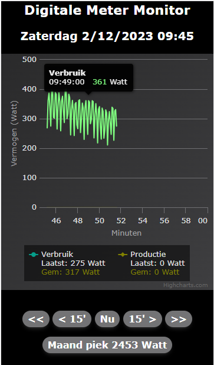
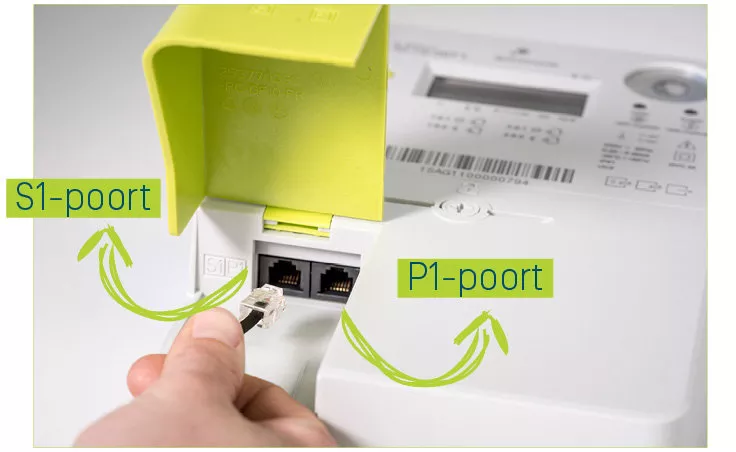
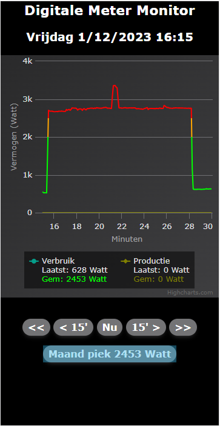
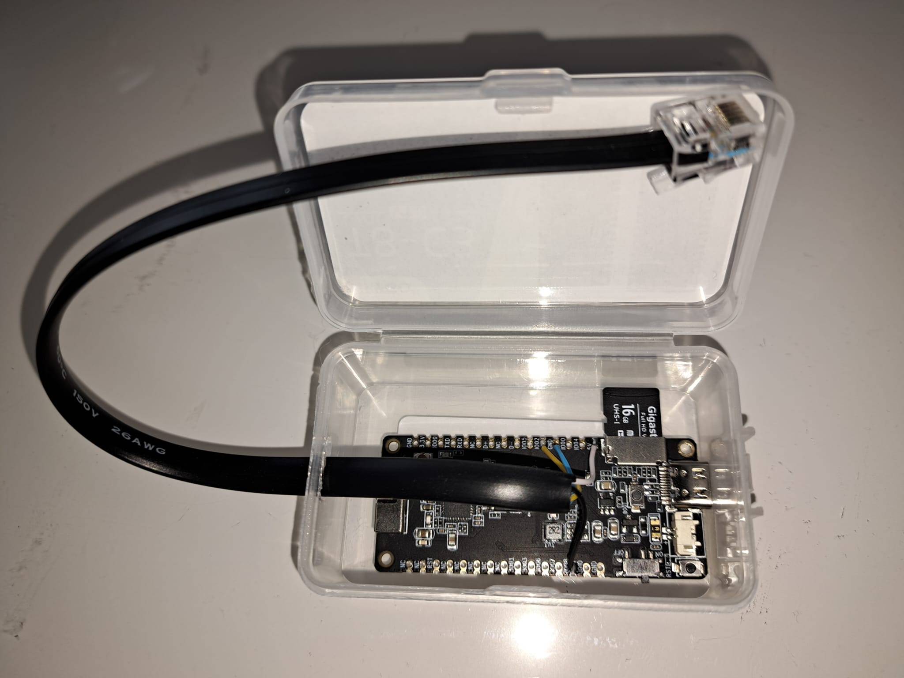

[](README.en.md)

Een gebruikers handleiding vind je hier: [Handleiding digitale meter monitor](https://docs.google.com/document/d/1RkHZzj7mp43RBCmY2G-Qf7itILN3JXueGeSpXl7rKZQ/edit?usp=sharing).

# Digitale meter monitor
De digitale meter monitor is vooral bedoeld voor slimme meters in België. Mits wat kleine aanpassingen is hij wellicht ook bruikbaar in Nederland. De monitor kan metingen opslaan en de huidige en historische metingen in real-time op je GSM of laptop/PC tonen. De monitor kan ook helpen om een zicht te krijgen op maand pieken die leiden tot een hoger capaciteits tarief (Typisch Belgisch). Voorts is de monitor heel geschikt om je te helpen grote verbruikers en nachtelijke sluimer verbruikers te helpen opsporen. 

De grootste verschillen met de metingen die je kan zien op de site van een netbeheerder zoals Fluvius zijn: 
- Er worden veel meer details bijgehouden. Je kan zo een detail per kwartier zien om te leren hoe je verbruik verliep. Elke 5 seconden wordt er een meting bijgehouden.   
- De huidige metingen kunnen direct worden getoond. Je moet dus geen dag wachten op je netbeheerder om je verbruik te kunnen raadplegen. 
- De monitor is een locale "in-huis" toepassing die geen cloud software gebruikt. 




De slimme digitale meter heeft een "P1 poort" langswaar de metingen kunnen ontvangen worden. 
> Gebruik de monitor nooit met de "S1 poort" omdat deze wellicht de monitor zal vernietigen.  



De P1 poort werkt niet zonder deze open te zetten via de website van je network operator (zoals Fluvius). Het kan enige dagen duren voor het "open zetten" effectief in werking komt. 

Het monitoren wordt gedaan door een ESP32 bordje waarvoor je de software hier vindt. 
In de borden secties verder in dit document wordt de nodige hardware setup beschreven. Dit omvat de connecties met een RJ12 kabel die in de P1 poort gestoken kan worden en het bord. De connecties zijn bord specifiek. Je hebt trouwens een RJ12 kabel nodig met 6 draden, een zogenaamde 6P6C kabel, geen 6P4C kabel. Het bordje krijgt ook de nodige spanning via deze kabel. 
> **OPGEPAST**: Verbind nooit het bordje met de digitale meter en met een USB kabel. 

Gedetaileerde metingen per kwartier worden opgeslagen op een micro SD card in JSON formaat. Daarom focussen we ons op hardware borden die een onboard SD card reader hebben. We laten andere opties open. Gebruik een 8GB tot 64GB micro SD card (Enkel getest tot 16GB). Het is best om de SD card eerst te formateren met een kleine cluster grootte (ook Allocation size genoemd soms), en dit omdat er veel kleine bestanden opgeslagen worden. 

De gebruikte borden hebben Wifi connectiviteit en deze software bied een web interface aan. Deze web interface is enkel bedoeld voor in-huis toegang (HTTP + u dient met op het thuis netwerk geconnecteerd te zijn, via een kabel of aanwezige Wifi's). Op de web interface kan je de huidige metingen bijna in real-time zien. Er zijn updates elke 5 seconden. Je kan ook makkelijk navigeren naar historische metingen. 

De metingen worden getoont per vaste kwartieren in het uur. Dit omdat het gemiddeld verbruik per kwartier gepenaliseerd kan worden door extra verbruikskosten voor gemiddelden hoger dan 2500 Watt. Er is een extra kost van ongeveer 4 euro (referentie 2023) per extra 1000 Watts boven 2500 Watt voor het hoogste gemiddelde kwartier verbruik in een maand. Dit is het zogenoemde capaciteits tarief. 

Men kan gemakkelijk navigeren naar de details van dit hoogste kwartier in de huidige maand indien de monitor toen ook gemeten heeft, door op de "Maand piek" knop te duwen. 



De bron code kan in theorie overweg met verschillende borden. In de praktijk is het LilyGo TTGO T8 ESP32-C3 bord het meest gebruikt en werkt dit dus zeker. Het is ook het meest energie efficientste bord. 


# De bron code gebruiken 
Zorg dat je "Visual Studio Code" met "Platform IO" geinstallerd hebt als ESP programeer omgeving.  
Platform IO heeft een ufo-achtig icoon op de linker zijde van VSCode om het te activeren.  
Klik je hierop zou je het het "PIO Home" menu kunnen zien en zo de "PIO Home" tab kunnen openen. 

Klik je daar op dit project, dan zou je er een tab per board type moeten vinden.  

Bij voorbeeld: "TTGO_T8_ESP32_C3"  

Zie de specifieke bord sectie verder in het document om naar hun hardware specifieke setup te kijken. 

Om een bordje werkende te krijgen moet je de code EN het filesysteem bouwen/builden en uploaden (beiden). Doe dit met Platform IO Project Tasks. Er kunnen bord specifieke actie zijn om het bord in program/upload mode te krijgen. Uiteindelijk zou je het bordje, met een USB kabel verbonden aan een PC, moeten kunnen programmeren.  

Zorg er ook voor dat er een micro SD card in het bordje zit. 


# Gebruik het bord met de geinstalleerde code en data
## Eerste opstart of opstart waarbij geen Wifi connectie mogelijk was
Verwijder een mogelijke aangesloten USB kabel van het bordje. 
Klik de RJ12 connector van je digitale meter monitor in de P1 poort van je digitale meter. 
Je zou nu een LED moeten zien branden. Is dit niet het geval check dan of je P1 poort wel "open" staat op de website van je netbeheerder (Fluvius). Het kan ook enkele dagen duren voor de poort werkt

> **OPGEPAST** : Verbind het bordje nooit met de digitale meter EN met een USB kabel. Het bordje wordt door de Digitale meter gevoed. 

> **ALTERNATIEF** : Je kan ook het bordje niet aan de digitale meter hangen, maar deels demonteren en met een USB kabel aan je laptop/PC hangen. Het krijgt dan zo spanning en Wifi configuratie is dan ook mogelijk. 

Bij een eerste opstart zal het bordje Wifi connectie parameters proberen ophalen van het config.json bestand op de micro SD card. 
Als dit bestand niet bestaat of er is geen Wifi connectie mogelijk, en dan zal het bordje opstarten in "configuratie mode". Het vormt dan zelf een Wifi netwerk "DigitaleMeterMonitor" waarop je je kan verbinden met GSM of laptop/PC. 
Dit kan ook automatisch gaan danzij mDNS die nu ook wordt ingesteld. 
Het bordje krijgt in deze mode trouwens een IP adres in een eigen netwerk van 192.168.4.1 en dit is een 192.168.4.0/24 netwerk. 
Eens verbonden kan je dus surfen naar http://digimon.local of http://192.168.4.1 alwaar je de Wifi configuratie kan doen voor toekomstige opstarts. 
> Soms is het moeilijk om op het "DigitaleMeterMonitor" netwerk te geraken en te blijven omdat er geen internet verbinding is in deze configuratie mode. 

De configuratie bestaat uit :
- Wifi netwerk / SSID waar het bord zich later mee moet verbinden.    
Dit is best het Wifi netwerk dat het dichtstbij is bij de monitor. 
> Veelal is er een modem/doos van de internet provider die in dezelfde technische ruimte staat en die ook een Wifi netwerk verzorgt of kan verzorgen. Voor Telenet kan je op "Mijn Telenet" de Wifi configuratie van de modem bekijken, aanzetten en aanpassen qua netwerk naam (SSID) en passwoord. Dit is typische zowel een 2.4 Ghz als 5 Ghz Wifi netwerk. Gebruik dan best dit netwerk tenzij er een dichter is. 

> Gebruik ook een Wifi netwerk dat altijd aanblijft staan ! 

- Wifi netwerk passwoord
- Naam van het toesten (mDNS naam / naam op het netwerk)
- Standaard wordt er dan IP configuratie gedaan met DHCP. 
- Men kan ook manual IP adres configuratie doen:  
  - IP adres: Het bord/de monitor heeft dan een vast IP adres. Kies een vrij IP adres in je thuis netwerk, typisch eindigend op een hoge waarde. Standaard gebruiken we 192.168.0.250. 
  > Als je een Telenet internet provider hebt kan je in "Mijn Telenet" kijken welke toestellen al IP adressen hebben. Alsook zal de Telenet modem typisich automatisch adressen uit delen aan toestellen resulterend in mogelijks gebruikte IP adressen eindigend op .2 tot .249 (en niet hoger). Dit is waarom onze default op .250 eindigt.  
  - Subnet: Dit is typisch 192.168.0.0/24. Het kan echter van je thuis setup afhangen of van je internet provider setup.
  - Gateway IP: Dit is typisch 192.168.0.1 of het .1 adress in je subnet. 

Eens deze configuratie doorgegeven is wordt ze opgeslagen in het config.json bestand op de micro SD card.  

Het bordje zal vervolgens herstarten en met de geconfigureerde Wifi proberen connecteren. 

Bij opstart zal de LED eerst langsaam beginnen branden en uitdovern. 
Dan zal de LED "hi" knipperen in mose code: '.... ..'.  
Uiteindelijk zal de LED slechts een beetje oplichten. Dit is goed nieuws. Het bordje kon zich verbinden met de Wifi en is klaar om metingen te ontvangen van de digitale meter.
Lukt dit niet kijk dan hieronder naar "Alternatieve Wifi configuratie".
De LED zal "wifi" knipperen in morse code: '.-- .. ..-. ..' en dit herhalen tot er configuratie gedaan is. 

Als er een probleem is met de SD card tijdens opstart zal de LED "sos" knipperen in morse code: '... --- ...' en met een hogere lichtsterkte. 

Als het bord geconnecteerd is met de P1 poort op je digitale meter (zonder ook de USB kabel aan te houden) zou de gedimde LED enkele keren per seconde moeten knipperen. Dit geeft aan dat er metingen binnen komen.

## Metingen bekijken 
Als het bordje werkt zou je het moeten kunnen contacteren met je GSM, laptop of PC via een browser (bijvoorbeeld chrome) via HTTP. 
Standaard is dat op http://192.168.0.250 of vervang hierin het IP adres dat je configureerde. 
Je zou dan metingen moeten kunnen zien.
Je moet ook wel geconnecteerd zijn op het zelfde thuis-netwerk. (Dat kan typische via kabel of een Wifi netwerk van je huis)  

## Alternatieve Wifi configuratie
Een alternatieve manier om de Wifi configuratie te doen is om het bordje te ontkoppelen zodat het niet werkt, er de micro SD card uit te halen, deze in een laptop/PC te steken (typisch met een adaptor; alsook niet elke laptop/PC heeft een SD card slot...). Je kan dan het config.json bestand wijzigen (of wegdoen). 

Het config.json bestand heeft het volgende formaat: 
````
{
  "wifi": {
    "ssid": "yourSSID",
    "password": "yourPassword"
  },
  "network": {
    "dhcp": false, 
    "device_name": "digimon",
    "ip" : "192.168.0.250",
    "gateway": "192.168.0.1",
    "subnet": "255.255.255.0"
  }
}
````

Wijzig dus wat je wil, sla op, ontkoppel de SD card proper van het besturing systeem van je laptop/PC en steek het kaartje weer in het bordje. 
Koppel het bordje weer aan op de digitale meter OF via een USB kabel. 

## Debug de opstart met een seriele monitor
Wanneer je nog problemen hebt met de opstart dan kan je de seriele monitor van Visual Studio Code met "Platform IO" extensie gebruiken om te zien wat het bord probeert te doen tijdens de opstart. 

De seriele monitoring ziet er bij een eerst opstart ongeveer alsvolgt uit: 

  ````
  Digital meter monitor using board: LilyGo TTGO T8 ESP32 C3 V1.1
  LED pin: 3
  Ports used for SD Card communication:
  MOSI: 7
  MISO: 5
  SCK: 4
  SS: 6
  SD Card sectorsPerCluster  64      
  SD Card OK
  Creating test dir /meter/2022/01/01
  Creating test file /meter/2022/01/01/hello.txt
  Serial pins used for communication to digital meter:
  RX1: 2, TX1: 0, RTS 8
  LittleFS Init OK
  No prior WIFI config
      Setup Mode
  --------------------------------
  SSID:
  DigitaleMeterMonitor
  Connect IP:
  192.168.4.1
  ````
De pin waarden zullen verschillen per bord type. 

In dit voorbeeld start het bordje op in "configuratie mode" en maakt het bordje het "DigitaleMeterMonitor" netwerk hiervoor.  

Wanneer de Wifi geconfigureerd is zou de opstart er alsvolgt moeten uitzien:
  ````
  Digital meter monitor using board: LilyGo TTGO T8 ESP32 C3 V1.1
  LED pin: 3
  Ports used for SD Card communication:
  MOSI: 7
  MISO: 5
  SCK: 4
  SS: 6
  Init SD SLOT SPI...
  SD SLOT SPI Pins set
  SD Card sectorsPerCluster  64      
  SD Card OK
  Creating test dir /meter/2022/01/01
  Creating test file /meter/2022/01/01/hello.txt
  Serial pins used for communication to digital meter:
  RX1: 2, TX1: 0, RTS 8
  LittleFS Init OK
  Opened /config.json file, size 138
  Previous SSID:
  ghost

  Connecting ...
  WL_CONNECTED
  Connected !
  192.168.0.248
  Syncronizeer Tijd
  --------------------------------
  ..............................Synced in 3000 ms.
  2023-12-02 13:37:27
  Verbruiksmonitor
  --------------------------------
````

Nadat het bord een eerste maal software en een filesystem image heeft gehad en kan connecteren op Wifi kan het worden geupgrade door te surfen naar:
````
http://digimon.local/update
````

Als gebruiker krijg je updates toegezonden met instucties die je via deze weg kan uploaden naar het bordje. 

Als programeur kan je eigen builds maken van de code of van het filesysteem en deze op het bordje zetten op afstand. 


# Web interface ontwikkeling
De "data" folder bevat bestanden voor de web applicatie op het bordje.

Deze bestanden worden op een flash file systeem gezet van het ESP bordje. Dit filesysteem is ook gekend als "little FS".

Je hoofdinteresse zal het index.html bestand zijn als ontwikkelaar. 
De code hierin krijgt huidige, historisch en maand piek data via de volgede HTTP GETs:  
- GET http://&lt;ip&gt;/current/quarter
  Dit komt uit het RAM geheugen. 
- GET http://&lt;ip&gt;>/meter/2023/12/01/1615W.json
  Dit komt uit de micro SD card. 
- GET http://&lt;ip&gt;>/current/month/peak
  Dit komt uit het RAM geheugen. 

De index.html pagina detecteerd wanneer ze gehost wordt vanaf een localhost server. In dit geval doet het GETs naar 192.168.0.250, alwaar mogelijks een functioneel bord aanwzig is al dan niet ingeplugd op de digitale meter. 
Dit faciliteerd debuggen omdat je zo gemakkelijk het index.html bestand kan wijzigen (zonder een file systeem build te maken) en de wijziging uit te proberen. 
Het wil wel zeggen dan je een http server moet draaien op je laptop/PC.  
Om dit te doen is er een Python httpserver.py bestand in de data folder die kan worden gelopen. 
Om te starten op locale poort 8000:
````
  cd data
  python httpserver.py
````
Je hebt hier natuurlijk een Python installatie voor nodig ! Dit is getest met Python 3.11.1 op een Windows PC. 

Hierna kan je surfen naar: 
http://localhost:8000
en kan je beginnen debuggen of wijzigingen doen in de html structuur of the javascript code zoals je wil. 


> **TODO** : het stuk hieronder moet nog vertaald worden:

# Board specifics
## TTGO T8 ESP32-C3
See: [LilyGo ESP32-C3 board with SD card interface](https://www.lilygo.cc/products/t8-c3)   
See: [NL Supplier link](https://www.tinytronics.nl/shop/en/development-boards/microcontroller-boards/with-wi-fi/lilygo-ttgo-t8-c3-esp32-c3-4mb-flash)

This is a LilyGO TTGO T8 ESP32-C3 module, which has an integrated SD card interface. 

- One needed to install special Serial USB drivers and reboot the PC or laptop first before the connection was even recognized as a serial port...
  See: [Espressif page](https://docs.espressif.com/projects/esp-idf/en/v5.0.2/esp32c3/get-started/establish-serial-connection.html)
  Sometimes the serial port only comes up after using some other board or USB device as well ...
- To get the first Serial to work for debugging, we needed to set additional build flags so the first hardware serial goes out to the USB connector.
  ```` 
  build_flags = 
    -D TTGO_T8_ESP32_C3
    -DARDUINO_USB_MODE=1
    -DARDUINO_USB_CDC_ON_BOOT=1
  ````  
- To get the first upload working containing the above, one must manually enter program mode by:
  - Pressing the boot button (do not release)
  - Press the reset button and release
  - Release the boot button
  - Then upload...
  
- After investigation on the web and measuring, it seems the HardwareSerial.begin pulls up the RX pin as needed. 
  Measured 3.3V on RX1 -> PIN 2
  This would mean we don't need to foresee an external pull-up resistor !!!    
  We also discovered later that there is even an external-to-the-chip pull-up resistor.  

- Found out the hard way that pin 9 can not be used for RTS, because the connection to the DSRM pulls it down. This influences the ESP32 startup and it goes into program mode...

- The pinout of DSRM and colors for typical cables and connection to the ESP board are as follows: 

   |RJ12 PIN | P1 function | Wire color| ESP32 PIN | ESP Function | Comment |
   |---------|-------------|:---------:|--------|-----|---------|
   |P1 |  5V          | white  | 5V | 5V | 5V is near the SD Card interface on the board.<br> P1 is the leftmost wire in the RJ12 connector when the clip is on top | 
   |P2 | RTS Input    | black  | IO08 | RTS out | Active high input to let the meter send data (Active high due to optocoupler) |
   |P3 | GND for DATA | red    | | | Not used |   
   |P4 | No function  | green  | | | Not used
   |P5 |  TX          | yellow | IO02 | RX1 | Inverted due to opto coupler in meter. <br> Inverted in ESP/Software by HardwareSerial initialization | 
   |P6 |  GND for POWER | blue | GND | GND |

- Wiring overview: 
- Soldered and assembled example:  


## TTGO T8 ESP32-S2
See: [LilyGo supplier](https://www.lilygo.cc/products/esp32-s2)   
See: [Tinytronics supplier in NL for the ESP32-S2 board with SD card interface](https://www.tinytronics.nl/shop/nl/development-boards/microcontroller-boards/met-wi-fi/lilygo-ttgo-t8-esp32-s2-met-sd-kaart-slot)   
See: [Github examples ](https://github.com/Xinyuan-LilyGO/ESP32_S2)


This is a "LILYGO ESP32-S2" module (V1.1)
This is a board that holds an interface to put in a micro SD card. 

- There are 2 DIP switch blocks on the board that we normally do not touch. 
  The first DIP switch block is close to the USB connector. 
  When the Connector is to the left of the board, the switch positions are: UP, DOWN, UP, DOWN
  This corresponds to "USB" mode (slave mode -> your PC is the master)
  In another position one gets OTG mode (master mode, the board is an USB master and it can support other devices) 
  We never use the OTG mode.
  From what we can deduce OTG mode would interfere with the use of PIN 19 as an output signal for RTS. 

- Very special on this board is to get the SDCard working, one needs to set PIN 14 to HIGH. 
  This is not so visible on the schema, but otherwise, the V3V pin has no proper voltage and this also powers the SDCard...We spent some days finding this out...
 
After programming the board with the filesystem and code, it should start normally. 

- The pinout and colors are as follows: 
   |RJ12 PIN | P1 Function | Wire color | ESP32 PIN | ESP Function | Comment |
   |---------|-------------|:----------:|:----------|--------------|---------|
   | P1 | 5V         |  white  | 5V        | 5V | Left most wire in RJ12 connector with clip on top at digital meter |
   | P2 | RTS Input  |  black  | IO19      | RTS Out | Active high input to let the meter send data (Active high due to optocoupler) |
   | P3 | GND for DATA| red    |           | | Not used |
   | P4 | No function |green   |           | | Not used |
   | P5 | TX         | yellow  | IO18      | RX1 | Open collector output, hence inverted.<br> Inverted at reception by ESP Hardware serial initialization.<br> Pulled up on ESP board. | 
   | P6 | GND for POWER|blue   | GND       | GND ||

- Wiring overview: 